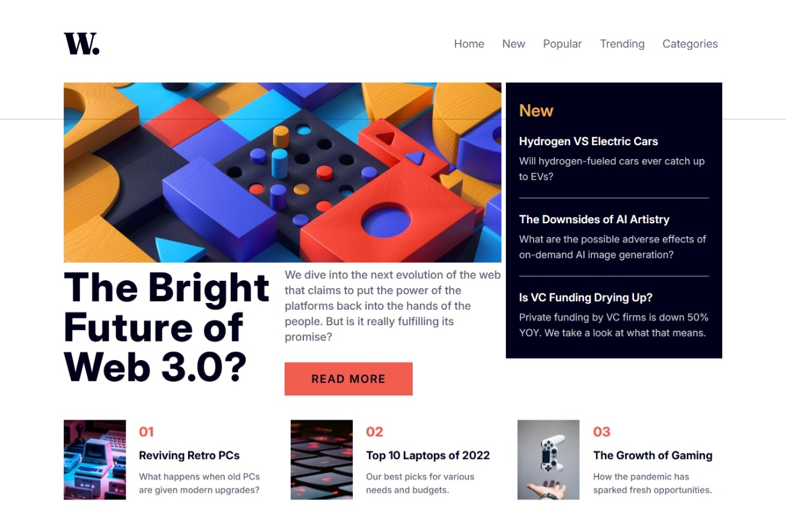
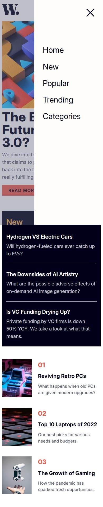

# Frontend Mentor - News homepage solution

This is a solution to the [News homepage challenge on Frontend Mentor](https://www.frontendmentor.io/challenges/news-homepage-H6SWTa1MFl). Frontend Mentor challenges help you improve your coding skills by building realistic projects.

## Table of contents

- [Overview](#overview)
  - [Screenshot](#screenshot)
  - [Links](#links)
- [My process](#my-process)
  - [Built with](#built-with)
  - [Challenges](#challenges)

## Overview

### Screenshot

### Links

- Live Site URL: [https://rookie-project-08.netlify.app/](https://rookie-project-08.netlify.app/)
- Solution URL : [https://github.com/akshay-ken/rookie-project-08](https://github.com/akshay-ken/rookie-project-08)

## My process

### Built with

- HTML5 / JSX
- Tailwind css
- Flexbox / Grid layout
- Mobile-first workflow
- [React](https://reactjs.org/) - JS library

### Challenges

> Problem: footer component touching the bottom edge of the screen.

- **solution**:- i added padding bottom on last children of footer component for mobile view and make it zero on desktop view.

> Problem: clicking on child div closes the menu.

- **solution**:- i used portal to create menu for mobile view and used onclick prop to close menu but used it on parent so its div child also behaving same so i used stop stopPropagation on onclick event of child div.

> Problem: having scroll effect when menu modal was open i wanted to disable scroll when menu is open

- **solution**:- i used useEffect hook to set overflow style when modal is open or close to disable scrolling.
